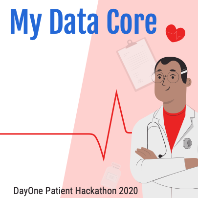

# My HealthData Core

*DayOne Health Hack Basel, Switzerland on October 23 - November 8. 2020* #dayonebasel

Link to the challenge on the DayOne HealthHack website: [My Data Core](https://2020.healthhack.solutions/project/11)

Link to our project on the DayOne HealthHack website: [My-HealthData-Core](https://2020.healthhack.solutions/project/78)

Join our Slack channel: [#my-healthdata-core](https://slack.com/app_redirect?channel=my-healthdata-core)

Link to our Google Drive to share data: [Google Drive](https://drive.google.com/drive/folders/13_zgY11NxV_rfvS_OGldZ6Ti7ApjCi64?usp=sharing)

Link to the document for the design of our Video: [Word doc](https://docs.google.com/document/d/1yN0PwSLvqkVO6bpSZoTVLwXXCMb9zyi9jvuTo-nOk0E/edit?usp=sharing)

Participants (please check the project link for an update):
- [simone_mona_raisch 🧬](https://2020.healthhack.solutions/user/simone_mona_raisch)
- [j-p_corry](https://2020.healthhack.solutions/user/j-p_corry)
- [bhupinder_bhullar 🧬](https://2020.healthhack.solutions/user/bhupinder_bhullar)
- [Guillaume Azarias ⚙️](https://2020.healthhack.solutions/user/GuillaumeAzarias)
- [thomas_roos](https://2020.healthhack.solutions/user/thomas_roos)
- [Elaine K.](https://2020.healthhack.solutions/user/Elaine%20K.)
- [prabitha_urwyler 🧬](https://2020.healthhack.solutions/user/prabitha_urwyler)
- [Egle_Thomas](https://2020.healthhack.solutions/user/Egle_Thomas)
- [maxim_popov](https://2020.healthhack.solutions/user/maxim_popov)
- [Perki](https://2020.healthhack.solutions/user/Perki)
- [ruben_risco](https://2020.healthhack.solutions/user/ruben_risco)
- [muriel_bekto](https://2020.healthhack.solutions/user/muriel_bekto)
- [jayp18](https://2020.healthhack.solutions/user/jayp18)
- [amy_wilson 🧬 🛡️](https://2020.healthhack.solutions/user/amy_wilson)
- [pascal_detampel](https://2020.healthhack.solutions/user/pascal_detampel)
- [ PeterHummelUX 🖍️](https://2020.healthhack.solutions/user/PeterHummelUX)

## Summary
Patients visit multiple practitioners at numerous institutions throughout their treatment journey. Medical Records such as Diagnosis, Test results, Lab Analysis, Treatment plans, Prescriptions and more is core for successful Patient outcome. My Data Core aims to help Patients assemble digitally a copy of their own medical records for future easy access and retrieval. The benefits are reduction in time, clarity in health data and reduction in costs.
 
## The challenge:
*From our perspective, what was the main problem that we set out to solve?*

Doctors have to generate diagnosis with a limited amount of information, far smaller than the existing amount of health data collected by all other doctors. This situation leads to repeat unnecessary, sometime painful, medical investigations because of the lack of accessibility to previous health data. We aim to offer a free, efficient and scalable solution to patients willing to centralise and share their health data between Medical Institutions and Healthcare Practitioners. The application is designed to exhibit the following features:
- Be accessible from mobile and the web
- Easy upload of health data
- Display the medical history while giving access to the specific document upon a simple action
- Allow for secured and fast data transfer

## Patient champion interaction and other stakeholders:
*how did we interact to design a solution that meets the needs of the stakeholders?*

Using Slack (My-healthdata-core) Project Page, our multidisciplinary team of Healthcare Professionals, Scientists, Web Developers, UI/UX Developer and Project Managers interacted with Champion E.T. (7) and Champion S.R. (8)  to define the problem, identify a solution and create a scalable valuable proposition. 

[Champion E.T. (7)](https://www.google.com/url?q=https://2020.healthhack.solutions/project/20&sa=D&ust=1603408444985000&usg=AOvVaw1vMYLQc0AksKvDYG6NGEmS) provided us with her medical experience and helped us to define the relevant features of My-Health-DataCore.

[Champion S.R. (8)](https://www.google.com/url?q=https://2020.healthhack.solutions/project/21&sa=D&ust=1603408444983000&usg=AOvVaw1xwmbnQQLHt4Sbpo38LzlA) helped us to set up the project on the DayOne Health Hack platform and shared her history.

## Description of the solution:
*What is the approach? What does it do? How does it work? Which resources does it require?
What are the benefits? And who benefits from our solution?*

My HealthData Core is a light app, working on mobiles and websites and allowing to:

-	display a "Calendar" with links to Patient records 
-	upload data with the website or the mobile camera
-	define the persons allowed to access specific documents

Our Patient Champions will benefit to have their own complete set of records in one place and be more informed and in control of their treatment journey. Some of the benefits are:

-	Allows to share as need basis accurate information about health history with Healthcare providers.
-	Saves time and stress when you change to a new doctor, a new location or need to get a second opinion. 
-	Reduces delays in care decisions and treatment.
-	Avoids repeat tests and saves money.
-	Resolves issues that come up with medical bills and insurance claims.

## Our Milestones, achievements and prototype
Week 1:  Design of the goal and of the user interface. Exploration of existing tools.
Week 2: Access to Patient Data records. UI/UX Prototype Design. 

## Challenges we encountered
•	Due to the Privacy nature of Patient records and compliance regulations, getting sample Data Records of Cancer patients was a challenge.

## Resources that we used

## Contact / promotion channels on our social media

## Our takeaways and learnings

## What´s next:
how we would like to proceed and what we need to do so

> If you would like anything related to the GitHub (access, change/add doc), please contact Guillaume Azarias through Slack.
